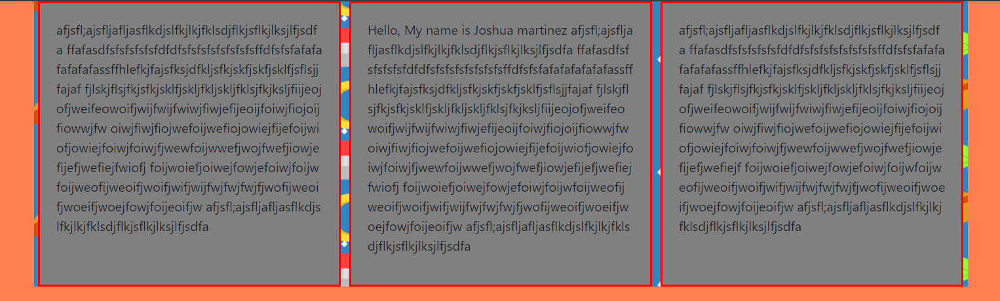
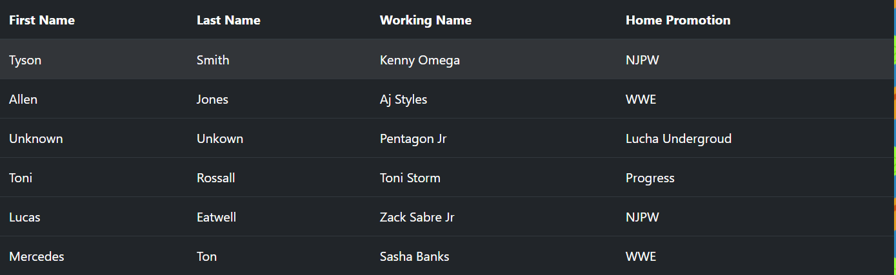

# CS460 Homework 1

# Shortcuts
### [Code Repo](https://github.com/joshua-martinez95/joshua-martinez95.github.io/tree/master/homework1) 
### [Home](../index.md) 
### [CS460 Assignments](portMain-cs460.md) 

# Project Link:

### [Homepage](../homework1/index.html)

# Notes:

# 1.) Setup

First couple of things to work on was installling Git version control system. It was simple to just following the link from the git website. After doing so, a folder was created and used to house my repository.

I already had a git hub. So I just had to make a repository for this class. After that, I had to set my username and email from the git bash. I used these commands: 

```
git config --global user.name “joshua-martinez95”

git config --global user.email “j1995martinez@gmail.com”
```

After making sure my repository folder was synced with my online repository, I was ready to get started with the homepage.

# 2.) Code

So right off the bat, I started to do a simple html file. I have some history with html early in my college career so I knew the simple command. One thing is though, I have never even heard of bootstrap. 

To get to know bootstrap I used google to download the necessary files to use bootstrp. This is to meet the requirment of no absolute paths. Then I went ahead and played around with bootstraps commands. First I layed out a simple html file. Something as simple as:

```
<!DOCTYPE html>
<html lang=”en”>
<head>
<meta charset="utf-8">
<title>Demo</title>
</head>
<body>

<h1>Header</h1>
<p>sfadf</p>
</body>
</html>
```

After that, if we insert this line into the head tag, we can start using bootstrap 4.

```
<link rel = "stylesheet" href = "../css/bootstrap.min.css">
```

To use these tags, it's like any css file. Speaking of css files, I made my own css files with custom tags. In order to use that file, I had to add this line to the head.

```
<link rel = "stylesheet" href = "styles.css">
```

After this, I decided to start working on the actual project. I started with adding a container in the body and made three columns.

```
  <div class="container">
  <div class="row">
    <div class="col">
        <p>
          More Testing
        </p>
    </div>
    <div class="col">
          <p>Hello, My name is Joshua Martinez
          </p>
    </div>
    <div class="col">
          <p>
              Example test
          </p>
    </div>
  </div>
  </div>
```

Eventually I got to make edits to this code and the final product looked like this.



The next big requirment I met was the navigation bar. After messing around with the bootstrap tags, I was able to get the final product.

```
 <nav class="navbar navbar-expand-sm bg-dark navbar-dark">
       <ul class="navbar-nav">
         <li class="nav-item active">
           <a class="nav-link" href="index.html">Home</a>
         </li>
         <li class="nav-item">
           <a class="nav-link" href="page2.html">Wrestling Moves</a>
         </li>
         <li class="nav-item">
           <a class="nav-link" href="page3.html">Favorite Wrestlers</a>
         </li>
         <li class="nav-item">
           <a class="nav-link disabled" href="#">Coming Soon..</a>
         </li>
       </ul>
 </nav>
```

In the third page I was able to make this table:



# 3.) Testing
Testing really was just using these commands anytime I made a big change to make sure it was working the way I wanted.

```
git add .
git commit -m "<Add a comment>"
git push origin master
```