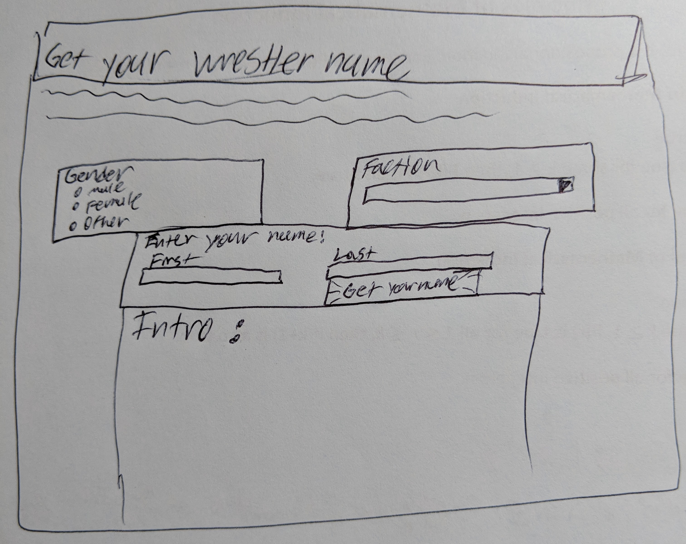

# CS460 Homework 2

# Shortcuts
### [Code Repo](https://github.com/joshua-martinez95/joshua-martinez95.github.io/tree/master/homework2) 
### [Home](../index.md) 
### [CS460 Assignments](portMain-cs460.md) 

# Project Link:

### [Homepage](../homework2/index.html)

# Notes:

# 1.) Setup
Starting out I had to make a new branch so I gave git the command:
```
git checkout -b homework2Branch
```
Now from here I created new directories

```
mkdir homework2
cd homework2
mkdir pictures
mkdir songs
```

Then started simple html file.

```
<!DOCTYPE html>
<html lang="en">
<head>
        <title>Let's See Your Work Name</title>
        <meta charset="utf-8">
        <meta name="viewport" content="width=device-width, initial-scale=1">
        <link rel = "stylesheet" href = "../css/bootstrap.min.css">
        <link rel = "stylesheet" href = "styles.css">
        <script src="https://ajax.googleapis.com/ajax/libs/jquery/3.1.0/jquery.min.js"></script>
        <script src="scriptJava.js"></script>
</head>
<body>
</body>
</html>
```
In the head, we reference the bootstrap file, our css file, javascript file and the jquery file from google. 

# 2.) Code
My idea for the page was: 


For the html file, it was pretty easy. Just adding containers for most elements. Like the Gender, Faction, and box for entering your name.
To add radio buttons: 
```
<form>
    <!-- Radio buttons for gender -->
    <input type="radio" name="gender" value="male">Male<br>
    <input type="radio" name="gender" value="female">Female<br>
    <input type="radio" name="gender" value="other">Other<br>
</form>
```

After that I had to make the drop down list for the factions:
```
<select id="faction">
    <!-- Drop down list for faction group -->
    <option value="None">None</option>
    <option value="Bullet Club">Bullet Club</option>
    <option value="Chaos">Chaos</option>
    <option value="Los Ingobernables de Japon">Los Ingobernables de Japon</option> 
    <option value="Suzuki-Gun">Suzuki-Gun</option>
    <option value="The NWO">NWO</option>
    <option value="The Undisputed Era">Undisputed Era</option>
</select>
```

Adding the text boxes and the button
```
<div class="col">
<form> 
    First Name:<br>
    <input id="fN">
</form>
    </div>
    <div class="col">
    Last Name:<br>
    <input id="lN">
<form>
    <button type = "button" id="button">Get your working name!</button>
</form>
```
Simple things. But working with javascript and jquery was more challenging
```
$(document).ready(function(){
    $("#button").click(function(){
        check()
    });
});
```

This function gets called once the button gets pushed and calls the next command.

After that, I had to figure out how to get the information from the text boxes and selections:

```
function check() {
    var sex, lastN, fact;
    //get names from text field
    lastN = document.getElementById("lN").value;
    firstN = document.getElementById("fN").value;
    // get gender from radio button
    sex = document.querySelector('input[name = "gender"]:checked').value;
    // get value from drop down
    fact = document.getElementById("faction");
    fact = fact.options[fact.selectedIndex].value;
    console.log(lastN)
    console.log(firstN)
    // call getName function
    getName(firstN, lastN, sex, fact)
    return false;
}
```

When I'm selecting a name based on the user's actual name I run through arrays like this: 

```
    if (gen == "male") {
        var firstA= ["Mighty", "Grand", "Primal", "Maverick", "Bad News","Dirk", "Diamond", "Johnny", "Gunner", "Cerebral", "Butch", "Brooklyn", "Outlaw", "Prince", "Bunkhouse", "Titanic", "Bionic", "Doctor", "Freak", "Fusion", "Rocky", "Sundance", "Triple", "King Kong", "Beefy", "Crazy"]
        var secondA= ["Shadow", "Hellfire", "Basher", "Swagger","Spider", "Snake","Hulk", "Viper", "Spike", "Magnum", "Hercules", "Spawn", "Warrior", "Sniper" ,"Tiger", "Swarm", "Champ", "Show", "Ninja", "Executioner", "Tornado", "Cowboy", "Hawk", "Slate", "Assassin", "Tank"]
    }
```
Male, Female, and Other are chosen like this.

In the end I decided to play the music of the factions chosen. Using:
```
audio.play();
```

# 3.) Final Touches


To merge branches in the end I gave git these commands:
```
git checkout master

git merge homework2Branch

git add .

git commit -m 'done with everything but portfolio'

git push origin master
```