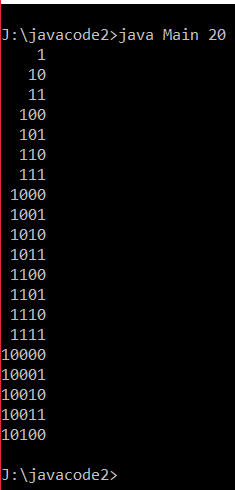
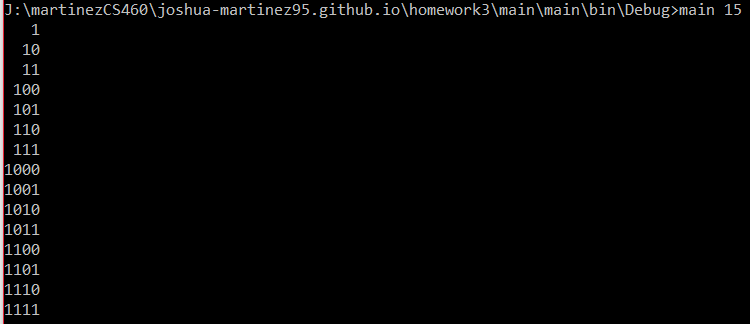

# CS460 Homework 2

# Shortcuts
### [Code Repo](https://github.com/joshua-martinez95/joshua-martinez95.github.io/tree/master/homework3) 
### [Home](../index.md) 
### [CS460 Assignments](portMain-cs460.md) 

# Project Link:

### [Homepage](../homework3/main/main/)

# Notes:

# 1.) Setup
I've never worked in C# so there was alot of setup to do. First I had to install Visual Studio.
I install Visual Studio on both my laptop and dekstop computer to work on this project on both computers.


# 2.) Code
Now was time to investigate the orginal Java code. I've used Java alot in the past, it's the second language I learned. So reading this code was easy for me. 

I ran the Java code by compling it from Textpad first and then running it from command line



Just as I thought, the tree printed like it was suppose to. 

Now was time to start converting the java code to C# code. But before than, I created a new branch to store my code there.
```
git branch checkout -b homework3Branch
```
First code I started to convert was the Node file:
```
/** Singly linked node class. */

public class Node<T>
{
	public T data;
	public Node<T> next;
	
	public Node( T data, Node<T> next )
	{
		this.data = data;
		this.next = next;
	}
}

```

C#

```
using System;

namespace hw3
{   
    /// <summary>
    /// singly linked node class
    /// </summary>
    /// <typeparam name="T"></typeparam>
    public class Node<T>
    {
        /// <summary>
        /// stores data
        /// </summary>
        public T stuff;

        /// <summary>
        /// what node is next
        /// </summary>
        public Node<T> next;

        /// <summary>
        /// constructor
        /// </summary>
        /// <param name="stuff"></param>
        /// <param name="next"></param>
        public Node(T stuff, Node<T> next)
        {
            this.stuff = stuff;
            this.next = next;
        }
    }
}
```

This class bascially makes the Node class. It's the backbone of the whole project. Because all the other classes mostly rely on this one.

Then I started on the QueueInterface code.

```
using System;
    /// <summary>
    /// a FIFO queu interface. For a singly linked queue
    /// </summary>
    /// <typeparam name="T"></typeparam>
	interface QueueInterface<T>
	{
        ///Add an element to the end of the queue
        ///
        /// return the elemtn that was enqueued
        ///
        
        T push(T element);

        /// removes and returns the front element
        /// 
        /// throws Thrown if the queue is empty

        
        T pop();
        
        bool isEmpty();
	}

```
This was pretty easy to convert. This class mostly just holds functionality like push and pop.

Next was the QueueUnderflowException.

I needed to find out what's the C# version of extends and the super() commands.
I found out that using the colon and the base() commands were the answer, repectively.
```
using System;

namespace hw3Ex
{
    /// <summary>
    /// This is a custom unchecked exception to represent situations whee
    /// an illegal operation was performaed on an empty queue.
    /// translated from a java file.
    /// </summary>
	class QueueUnderflowException : Exception
    {
        public QueueUnderflowException() : base() { }


        /// <summary>
        /// This prints the exception message
        /// </summary>
        /// <param name="message"></param>
        public QueueUnderflowException(string message)
            :base(message)
        {
        }
    }
}
```

Next was the LnkedQueue file. This one held the actual commands for pop, push and isEmpty()
Personally I felt this was simple to convert, just because alot of the code is easily translated. But in the case that there was work to be done to translate, (for example: using the queueinterface), I had already learned how to do that in the eariler conversions.

In the end, it was the main file (I called it Program.cs) to translate. 
The main difficulties I ran into here were once I had translated the code to C#, The numbers would print, but would print all on one line. I was confused on how to fix to for a while. But then I thought, maybe it's because I need a new line. So all I had to do was add a newline character to the loop that prints the line.

```
LinkedList<string> output = generateBinaryRepresentationList(n);
int maxLength = output.Last().Length;
foreach (string s in output)
    {
        for(int i = 0; i < maxLength - s.Length; ++i)
        {
            Console.Write(" ");
        }
        Console.Write(s+"\n");
    }
```


# 3.) Testing
Now to test this code:
