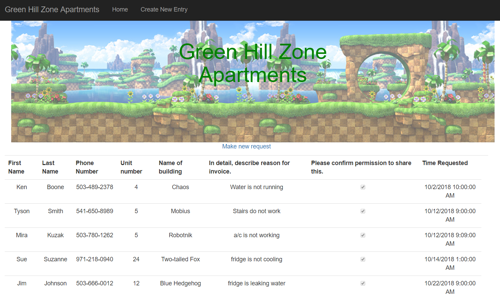
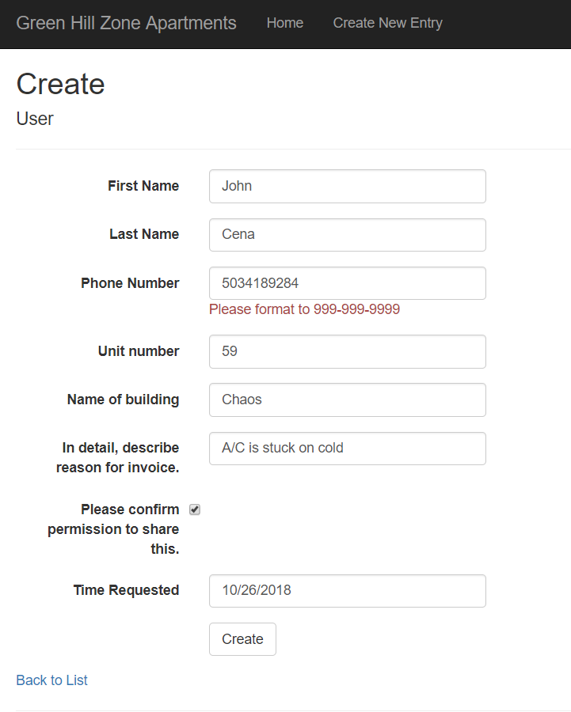
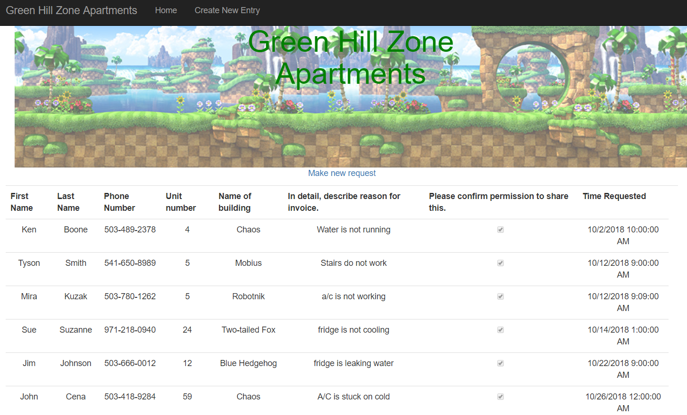
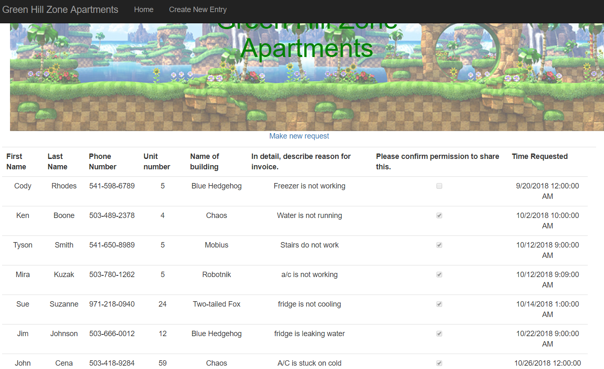

# CS460 Homework 5

# Shortcuts
### [Code Repo](https://github.com/joshua-martinez95/joshua-martinez95.github.io/tree/master/homework5) 
### [Home](../index.md) 
### [CS460 Assignments](portMain-cs460.md) 


# 1.) Setup
First I decided to start a new ASP.Net projct on Visual Studio.
I also had to setup a database, by right clicking on App Data and creating a new database.

Then I had to set up the connection string, by adding a couple lines of code to Web.config
```
<connectionStrings>
   <add name="OurUsers" connectionString="Data Source=(LocalDB)\MSSQLLocalDB;AttachDbFilename=J:\martinezCS460\martinezCS460\homework5\homework5\App_Data\OurUsers.mdf;Integrated Security=True" providerName="System.Data.SqlClient" />
</connectionStrings>
```
Then we had to make a model. This would be what an entry should look like.

```csharp
    /// <summary>
    /// the class for entries
    /// </summary>
    public class User
    {
        /// <summary>
        /// The key ID for each entry
        /// </summary>
        [Key]
        public int ID { get; set; }

        /// <summary>
        /// How the First name will/should look like
        /// </summary>
        [Required, Display(Name = "First Name")]
        [StringLength(20)]
        public string FirstName { get; set; }

        /// <summary>
        /// how Last name will/should look like
        /// </summary>
        [Required, Display(Name = "Last Name")]
        public string LastName { get; set; }

        /// <summary>
        /// how phone number will/should look like with certain pattern
        /// </summary>
        [Required, DataType(DataType.PhoneNumber), RegularExpression(@"^\d{3}-\d{3}-\d{4}$", ErrorMessage = "Please format to 999-999-9999"), Display(Name = "Phone Number")]
        public string PhoneNum { get; set; }

        /// <summary>
        /// Unit number in integer
        /// </summary>
        [Required, Display(Name = "Unit number")]
        public int AptNumber { get; set; }

        /// <summary>
        /// Name of building
        /// </summary>
        [Required, Display(Name = "Name of building")]
        public string AptName { get; set; }

        /// <summary>
        /// Comment field
        /// </summary>
        [Required, Display(Name = "In detail, describe reason for invoice.")]
        public string Comment { get; set; }

        /// <summary>
        /// check box
        /// </summary>
        [Required, Display(Name = "Please confirm permission to share this.")]
        public bool CheckBox { get; set; }

        /// <summary>
        /// get date and time of submission
        /// </summary>
        private DateTime timeDate = DateTime.Now;
        [Required, Display(Name = "Time Requested")]
        public DateTime TimeRequest
        {
            get { return timeDate; }
            set { timeDate = value; }
        }
    }
```
Then we made a context class, this will actually be connected to so everything works correctly.

```csharp
namespace homework5.DAL
{
    public class UserContext : DbContext
    {
        public UserContext() : base("name=OurUsers")
        {

        }
        public virtual DbSet<User> Users { get; set; }
    }
}
```

Then to make the table with the initial values had to make an SQL query, first to build the table then to fill the first 5 spots
```sql
CREATE TABLE [dbo].[Users]
(
    [ID]        INT IDENTITY (1,1)    NOT NULL,
    [FirstName]    NVARCHAR(64)        NOT NULL,
    [LastName]    NVARCHAR(128)        NOT NULL,
    [PhoneNum]        NVARCHAR(12)            NOT NULL,
	[AptNumber]		INT				NOT NULL,
	[AptName]		NVARCHAR(20)		NOT NULL,
	[Comment]		NVARCHAR(1000)		NOT NULL,
	[CheckBox]				BIT		NOT NULL,
	[TimeRequest]		DATETIME		NOT NULL,

    CONSTRAINT [PK_dbo.Users] PRIMARY KEY CLUSTERED ([ID] ASC)
);

INSERT INTO [dbo].[Users] (FirstName, LastName, PhoneNum, AptNumber, AptName, Comment, CheckBox, TimeRequest) VALUES
    ('Jim','Johnson', '503-666-0012', 12, 'Blue Hedgehog', 'fridge is leaking water', 1, '2018-10-22 09:00:00'),
    ('Sue','Suzanne','971-218-0940', 24, 'Two-tailed Fox', 'fridge is not cooling', 1, '2018-10-14 01:00:00'),
    ('Mira','Kuzak','503-780-1262', 5, 'Robotnik', 'a/c is not working', 1, '2018-10-12 09:09:00'),
	('Ken', 'Boone', '503-489-2378', 4, 'Chaos', 'Water is not running', 1, '2018-10-02 10:00:00'),
	('Tyson', 'Smith', '541-650-8989', 5, 'Mobius', 'Stairs do not work', 1, '2018-10-12 09:00:00')
GO
```
In order to check the values were there, used this SQL Query
```
SELECT *
FROM Users;
```
Then we make a UsersController using VS. We will truncate this into only the bits we need.

# 2.) Code

Now that we have most of our setup done. We can start setting things in place. Starting with the controller.
We just needed to keep the Index, both Create classes and Dispose. Leaving this.
Create will have 2 versions, one for inital page, the other that uses HTTPPOST.

```csharp
    public class UsersController : Controller
    {
        private UserContext db = new UserContext();

        /// <summary>
        /// This will list the entires, sorted by Time and date
        /// </summary>
        /// <returns></returns>
        public ActionResult Index()
        {
            /// returns the table sorted by time
            return View(db.Users.ToList().OrderBy(item => item.TimeRequest));
        }

        /// <summary>
        /// Display initial Create page
        /// </summary>
        /// <returns></returns>
        public ActionResult Create()
        {
            return View();
        }

        /// <summary>
        /// Once the submission page is pressed, do this action
        /// </summary>
        /// <param name="user"></param>
        /// <returns></returns>
        [HttpPost]
        [ValidateAntiForgeryToken]
        public ActionResult Create([Bind(Include = "ID,FirstName,LastName,PhoneNum,AptNumber,AptName,Comment,CheckBox,TimeRequest")] User user)
        {
            if (ModelState.IsValid)
            {
                db.Users.Add(user);
                db.SaveChanges();
                return RedirectToAction("Index");
            }

            return View(user);
        }

        protected override void Dispose(bool disposing)
        {
            if (disposing)
            {
                db.Dispose();
            }
            base.Dispose(disposing);
        }
    }
```
Then we can start the views for Index and Create views. For Index, I wanted to put a banner so the CSS code for it looked like
```html
<style>
 .wrapper, img{
        width: 100%;
        height: 100%;
        opacity: .60;
    }
    /* Container holding the image and the text */
    .container {
        position: relative;
        text-align: center;
    }

    /* Centered text */
    .centered {
        position: absolute;
        top: 50%;
        left: 50%;
        transform: translate(-50%, -50%);
    }
    /* text format for image overlay*/
    .banner-text{
        text-align: center;
        position: absolute;
        top: 50%;
        left: 50%;
        transform: translate(-50%, -50%);
        color: green;
    }
</style>
```

This Will show our actual banner, with the name of the apartments fully stylized.

```html
    <!-- Container that will hold banner -->
<div class ="container" id="wrapper">
    
    <div class="centered banner-text"><h1 style="font-size:50px">Green Hill Zone Apartments</h1></div>
</div>
```

To display the table AND the entries we used this html/razor code
This was fairly simple to do, using razor code made it even more simple. 

```html
<!-- Display current table columns -->
<table class="table">
    <tr>
        <th>
            @Html.DisplayNameFor(model => model.FirstName)
        </th>
        <th>
            @Html.DisplayNameFor(model => model.LastName)
        </th>
        <th>
            @Html.DisplayNameFor(model => model.PhoneNum)
        </th>
        <th>
            @Html.DisplayNameFor(model => model.AptNumber)
        </th>
        <th>
            @Html.DisplayNameFor(model => model.AptName)
        </th>
        <th>
            @Html.DisplayNameFor(model => model.Comment)
        </th>
        <th>
            @Html.DisplayNameFor(model => model.CheckBox)
        </th>
        <th>
            @Html.DisplayNameFor(model => model.TimeRequest)
        </th>
        <th></th>
    </tr>
<!-- Display actual table information -->
@foreach (var item in Model) {
    <tr>
        <td>
            @Html.DisplayFor(modelItem => item.FirstName)
        </td>
        <td>
            @Html.DisplayFor(modelItem => item.LastName)
        </td>
        <td>
            @Html.DisplayFor(modelItem => item.PhoneNum)
        </td>
        <td>
            @Html.DisplayFor(modelItem => item.AptNumber)
        </td>
        <td>
            @Html.DisplayFor(modelItem => item.AptName)
        </td>
        <td>
            @Html.DisplayFor(modelItem => item.Comment)
        </td>
        <td>
            @Html.DisplayFor(modelItem => item.CheckBox)
        </td>
        <td>
            @Html.DisplayFor(modelItem => item.TimeRequest)
        </td>
    </tr>
}
```

Now that we can see our table, we need to make a page that lets us create new entries for our page. This will use the Index in the controller
There is alot of code that comes into play here, so I'll show one example, the other cases are pretty similar.

```html
<!-- Form for the time request-->
        <div class="form-group">
            @Html.LabelFor(model => model.TimeRequest, htmlAttributes: new { @class = "control-label col-md-2" })
            <div class="col-md-10">
                @Html.EditorFor(model => model.TimeRequest, new { htmlAttributes = new { @class = "form-control" } })
                @Html.ValidationMessageFor(model => model.TimeRequest, "", new { @class = "text-danger" })
            </div>
        </div>
```

In the other cases, most of the differences will be about  variables. (First Name, Last Name, etc)


# 3.) Final Product


Now lets see the Index page: 



As you can see the initial entries from our query have shown up! Which means we connected correctly to the database.

Now let's try to add a new entry. Since we added the pattern checking, we can see that this entry for the phone number gives us an error.



Once fixed, we can see that the value was added to the already existing table.



Now let's add a new entry just cause

