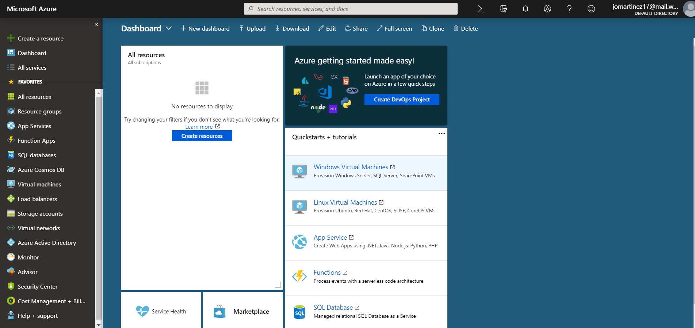
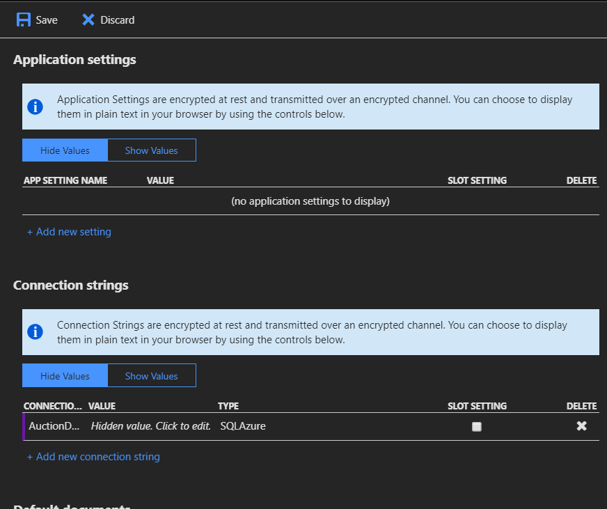

# CS460 Homework 9

# Shortcuts
### [Code Repo](https://github.com/joshua-martinez95/joshua-martinez95.github.io/tree/master/homework9) 
### [Home](../index.md) 
### [CS460 Assignments](portMain-cs460.md) 

# Project Link:

### [Homepage](../homework9/)

# Notes:

# 1.) Images
Starting process

# Setting up resources

# Setting up sql database

# Setting up Web App

# App settings

# Done

http://hw9martinez.azurewebsites.net/